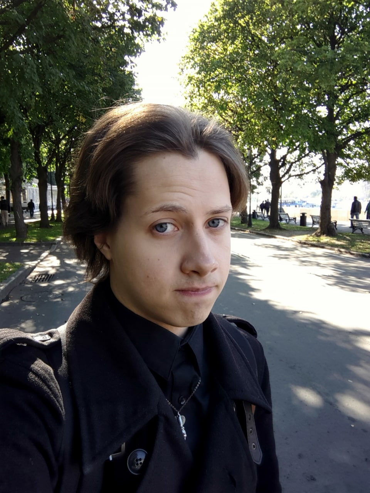

* Должность: Преподаватель (а если быть точнее, то преподаватель Жабы)
* Стаж работы: ...
* Образование: Высшее техническое образование, специальность автоматизированные системы обработки информации и управления, МГУПИ, 2015 год

Далее мы задали несколько вопросов о научной деятельности и не только. 

**Вопрос:** Занимаетесь ли Вы исследовательской работой?

**Ответ:** На данный момент занимаюсь набором достаточного опыта в сфере игровой разработки, где в будущем планирую провести некоторые исследования.

**Вопрос:** Расскажите о проекте или достижении, которое Вы считаете самым значительным в Вашей карьере?

**Ответ:** Самостоятельно написал две игры на Java, чтобы лучше подавать студентам материал по данному предмету. 

**Вопрос:** С какими трудностями Вы столкнулись за всё время своей работы в университете? Как Вы справлялись с ними? 

**Ответ:** Бюрократия немного выматывает. :) Однако, хочется или нет, некоторые дела просто надо сделать, чтобы о них забыть. 

**Вопрос:** Что доставляет Вам наибольшее удовольствие в работе и в жизни? 

**Ответ:** Моменты, когда ты находишь как рассказать непонятную тему простыми словами, и ребята, которые никак не понимали, сами своими словами пересказывают, то что они только что поняли. Узнавать новое и видеть как прокачиваются твои навыки в течением времени.

**Вопрос:** Какими принципами Вы руководствуетесь в своей работе?

**Ответ:** Первый. Относись к студенту как к человеку и он потянется за тобой и будет интересоваться твоим предметом. 
Второй. Быть открытым для любых вопросов и не строить из себя "всезнайку" - ошибаться нормально и не важно кто ты.

**Вопрос:** Как Вы думаете, как дальше будет развиваться индустрия, в которой Вы работаете?

**Ответ:** Я надеюсь, что вузы внесут в учебный процесс больше тем/примеров/практик связанных с игровой разработкой, чтобы отечественная индустрия являла на свет новые шедевры, вплоть до крупнобюджетных.

**Вопрос:** Почему Вы выбрали профессию преподавателя? 

**Ответ:** Преподавание приносит большое удовольствие. В некотором роде - кураж. Особенно хорошо прокачивает твои навыки, ибо ты просто не имеешь права плохо рассказать предмет - его надо понять так, чтобы и другим объяснить. :)

**Вопрос:** Что Вам нравится или не нравится в Вашей профессии?

**Ответ:** Нравится общаться со студентами, ощущать от них интерес и отдачу, обмениваться опытом и узнавать новое. Создавать интересные лекции и сложные (простите, ребята) практики, чтобы дать им возможность прокачать свои навыки.
Не нравится формализм и некоторое присутствие бюрократии.

**Вопрос:** Какие советы Вы дадите студентам, идущим по Вашим стопам? 

**Ответ:** Если в сторону Java: пишите свои маленькие проекты - игры, программы и т.д. Только так вы по настоящему вырастите как разработчик.
Если в сторону преподавания: относитесь к тем, кого учите как к людям, не ведите себя высокомерно, ибо всегда есть предел ваших знаний, избегайте формализма и не бойтесь быть живым человеком.
